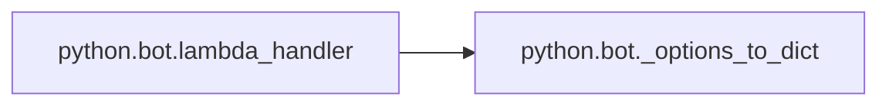

# Key Objects

[_Documentation generated by Documatic_](https://www.documatic.com)

<!---Documatic-section-python.bot.pricing-start--->
## python.bot.pricing

<!---Documatic-section-pricing-start--->
<!---Documatic-block-python.bot.pricing-start--->
<details>
	<summary><code>python.bot.pricing</code> code snippet</summary>

```python
def pricing(service, options=dict(), max=5):
    log.info('[pricing] service: {0} options: {1}'.format(service, options))
    try:
        check_service(service)
        pc = None
        if 'region' in options:
            pc = PricingContext(region=options['region'])
            options.pop('region')
        else:
            pc = PricingContext(region='us-east-1')
        pc.service = service
        pc.add_attributes(options)
        prices = get_prices(pc)
        response = ''
        i = 0
        for p in prices:
            response += 'Rate Code: {0} price:\n```\n{1}\n```\n'.format(p, json.dumps(prices[p], indent=2, sort_keys=True))
            if i >= max:
                response += '*-= Hit MAX responses =-*'
                break
            i += 1
        return response
    except ValueError as ve:
        return "Price for service '{0}' not yet supported.".format(service)
```
</details>
<!---Documatic-block-python.bot.pricing-end--->
<!---Documatic-section-pricing-end--->

# #
<!---Documatic-section-python.bot.pricing-end--->

<!---Documatic-section-python.bot._options_to_dict-start--->
## python.bot._options_to_dict

<!---Documatic-section-_options_to_dict-start--->
<!---Documatic-block-python.bot._options_to_dict-start--->
<details>
	<summary><code>python.bot._options_to_dict</code> code snippet</summary>

```python
def _options_to_dict(options):
    opts = dict()
    for option in options:
        found = re.findall('(\\w+)=(.+?)(?= \\w+=|$)', option)
        opts.update(dict(found))
        log.info('[options_to_dict] opts: {0}'.format(opts))
    return opts
```
</details>
<!---Documatic-block-python.bot._options_to_dict-end--->
<!---Documatic-section-_options_to_dict-end--->

# #
<!---Documatic-section-python.bot._options_to_dict-end--->

<!---Documatic-section-python.bot.lambda_handler-start--->
## python.bot.lambda_handler

<!---Documatic-section-lambda_handler-start--->


### Object Calls

* python.bot._options_to_dict

<!---Documatic-block-python.bot.lambda_handler-start--->
<details>
	<summary><code>python.bot.lambda_handler</code> code snippet</summary>

```python
def lambda_handler(event, context):
    assert context
    log.debug(event)
    bot_event = event
    trigger_word = bot_event['trigger_word']
    raw_text = bot_event['text']
    raw_args = raw_text.replace(trigger_word, '').strip()
    args = raw_args.split()
    log.debug('[lambda_handler] args:{0}'.format(args))
    if len(args) >= 1:
        command = args[0]
    if command not in commands:
        command = 'help'
    service = None
    if len(args) >= 2:
        service = args[1]
    options = ''
    if len(args) >= 3:
        options = args[2:]
    log.debug("[lambda_handler] command:'{0}' service:'{1}' options:'{2}'".format(command, service, options))
    resp = commands[command](service, _options_to_dict(options))
    return {'text': '{0}'.format(resp)}
```
</details>
<!---Documatic-block-python.bot.lambda_handler-end--->
<!---Documatic-section-lambda_handler-end--->

# #
<!---Documatic-section-python.bot.lambda_handler-end--->

<!---Documatic-section-python.bot.bot_help-start--->
## python.bot.bot_help

<!---Documatic-section-bot_help-start--->
<!---Documatic-block-python.bot.bot_help-start--->
<details>
	<summary><code>python.bot.bot_help</code> code snippet</summary>

```python
def bot_help(service, options=dict()):
    log.debug('[bot_help] service_name: {0} options: {1}'.format(service, options))
    h = 'Available commands `{0}`\n'.format(commands.keys())
    h += 'Usage: `awsfaq <command> <service> <option1> <option2> ...`'
    return h
```
</details>
<!---Documatic-block-python.bot.bot_help-end--->
<!---Documatic-section-bot_help-end--->

# #
<!---Documatic-section-python.bot.bot_help-end--->

<!---Documatic-section-python.bot.show-start--->
## python.bot.show

<!---Documatic-section-show-start--->
<!---Documatic-block-python.bot.show-start--->
<details>
	<summary><code>python.bot.show</code> code snippet</summary>

```python
def show(service, options=dict()):
    log.debug('[show] service: {0} options: {1}'.format(service, options))
    if service is None or service == 'pricing':
        if 'region' in options:
            pc = PricingContext(region=options['region'])
            options.pop('region')
        else:
            pc = PricingContext(region='us-east-1')
        pc.add_attributes(options)
        olist = ''
        for (i, o) in enumerate(pc.idx['offers']):
            if i < len(pc.idx['offers']) - 1:
                olist += o + ', '
            else:
                olist += o
        return olist
```
</details>
<!---Documatic-block-python.bot.show-end--->
<!---Documatic-section-show-end--->

# #
<!---Documatic-section-python.bot.show-end--->

[_Documentation generated by Documatic_](https://www.documatic.com)